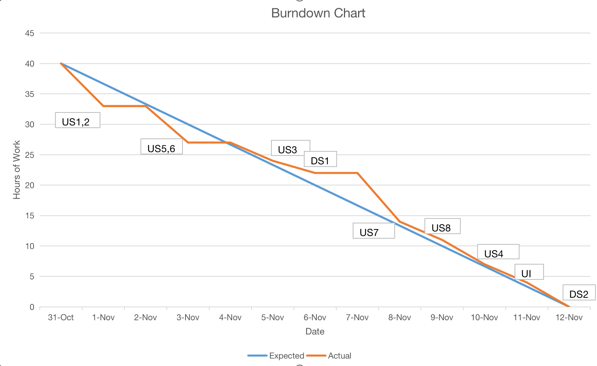

_CSE 110 Project: Team 35_

# Our Burndown Chart:

# Instructions for Running App
1. Clone the Repo
2. Download JavaFX

**VSCODE INSTRUCTIONS**

4. Create a launch.json file in the .vscode folder
5. Add run arguments
   
        {
            "type": "java",
            "name": "App",
            "request": "launch",
            "mainClass": "cse.project.team.App",
            "projectName": "app",
            "vmArgs": "--module-path '<PATH TO YOUR JAVAFX LIB DIR' --add-modules javafx.controls,javafx.fxml"
        }
   
6. Run Server.java to start up the server which will process http requests
7. Run App.java to launch the GUI and access the app's main functionality

Sources used:  
  The getSource() Method  
    Link:           https://chortle.ccsu.edu/java5/notes/chap64/ch64_10.html 
    Date captured:  10/2023 
    Use:            For information on using an EventHandler's getSource. 
    
  Model-View-Controller Framework  
    Link:           https://www.pragmaticcoding.ca/beginners/part5  
    Date captured:  10/2023  
    Use:            For review of MVC design. 

  How to Switch Scenes | JavaFX GUI Tutorial for Beginners (video) 
    Link:           https://www.youtube.com/watch?v=SB9AnciLmsw 
    Date captured:  10/2023 
    Use:            For information on switching scenes in JavaFX. 

  CSS Tutorial 
    Link:           https://www.w3schools.com/css/ 
    Date captured:  10-11/2023 
    Use:            For learning about CSS. 

  Getting Started with JavaFX 
    Link:           https://openjfx.io/openjfx-docs/#gradle 
    Date captured:  11/2023 
    Use:            For understanding how to use JavaFX and Gradle together. 
    
  Spring: class file has wrong version 61.0, should be 55.0 
    Link:           https://stackoverflow.com/questions/74648576/spring-class-file-has-wrong-version-61-0-should-be-55-0 
    Date captured:  11/2023 
    Use:            For tips on debugging an issue we faced with a Gradle/Java version mismatch. 

  Transfer Audio File from Client to HTTP Server via URLConnection 
    Link:           https://stackoverflow.com/questions/37869483/transfer-audio-file-from-client-to-http-server-via-urlconnection 
    Date captured:  11/2023 
    Use:            Heavily referenced code written in top answer (by anon, posted on Jun 17, 2016) for handling Whisper 
                    requests through server. 

  Round Corners in JavaFX Pane 
    Link:           https://stackoverflow.com/questions/45258138/round-corners-in-java-fx-pane 
    Date captured:  10/2023 
    Use:            For information on working with background-radius properties in CSS. 

  Adding CSS File to Stylesheets in JavaFX 
    Link:           https://stackoverflow.com/questions/13946372/adding-css-file-to-stylesheets-in-javafx 
    Date captured:  11/2023 
    Use:            To learn how to add .css file to JavaFX objects. Referenced code written by user 'nikolaos'
                    on Apr 27, 2014 and later edited by user 'Rahil Wazir'. 
  
  Can I Have an Onclick Effect in CSS? 
    Link:           https://stackoverflow.com/questions/13630229/can-i-have-an-onclick-effect-in-css 
    Date captured:  11/2023 
    Use:            For information on handling style changes based on UI events (such as button clicks) in CSS. 

  How to get rid of focus highlighting in JavaFX 
    Link:           https://www.jensd.de/wordpress/?p=1245 
    Date captured:  11/2023 
    Use:            For information on hiding the blue glow that appears around editable objects (Buttons, TextAreas)
                    in JavaFX. 
  
  How to set AUTO-SCROLLING of JTextArea in Java GUI? 
    Link:           https://stackoverflow.com/questions/1627028/how-to-set-auto-scrolling-of-jtextarea-in-java-gui 
    Date captured:  11/2023 
    Use:            For information on using the .append() method to automatically scroll as text is added
                    to a TextArea. 

  JavaFX TextArea Hiding Scroll Bars 
    Link:           https://stackoverflow.com/questions/14206692/javafx-textarea-hiding-scroll-bars 
    Date captured:  11/2023 
    Use:            To learn how to hide scrollbars from view. Referenced CSS code from the second top answer written by user
                    'Michael Sims' on May 13, 2020. 

  How to remove this gray top border in JavaFX TextArea 
    Link:           https://stackoverflow.com/questions/26651198/how-to-remove-this-gray-top-border-in-javafx-textarea 
    Date captured:  11/2023 
    Use:            For information on ways to override the automatic styling of TextAreas in JavaFX. Heavily referenced code
                    from answer written by user 'José Pereda' on Oct 30, 2014.  

  Typing Animation on a Text with JavaFX 
    Link:           https://stackoverflow.com/questions/33646317/typing-animation-on-a-text-with-javafx 
    Date captured:  11/2023 
    Use:            For information on using the Timeline and Keyframe classes to create a "typed out" animation in JavaFX. 
